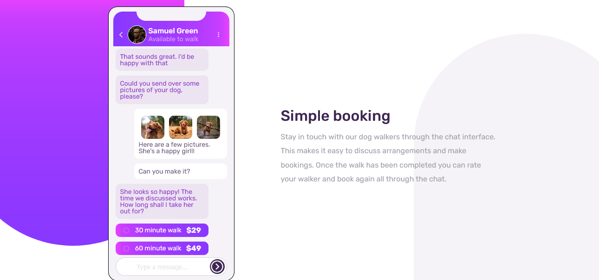
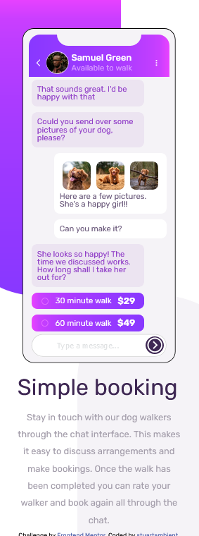

# Frontend Mentor - Chat app CSS illustration solution

This is a solution to the [Chat app CSS illustration challenge on Frontend Mentor](https://www.frontendmentor.io/challenges/chat-app-css-illustration-O5auMkFqY). Frontend Mentor challenges help you improve your coding skills by building realistic projects.

## Table of contents

- [Overview](#overview)
  - [The challenge](#the-challenge)
  - [Screenshot](#screenshot)
  - [Links](#links)
- [My process](#my-process)
  - [Built with](#built-with)
  - [What I learned](#what-i-learned)
  - [Continued development](#continued-development)
- [Author](#author)
- [Acknowledgments](#acknowledgments)

**Note: Delete this note and update the table of contents based on what sections you keep.**

## Overview

### The challenge

Users should be able to:

- View the optimal layout for the component depending on their device's screen size
- **Bonus**: See the chat interface animate on the initial load

### Screenshot




### Links

- Solution URL: [Repo](https://github.com/stuartambient/chat-app-css)
- Live Site URL: [Live site](https://stuartambient.github.io/chat-app-css/)

## My process

Studied images, added html (the best I could to start), started styling.

### Built with

- Semantic HTML5 markup
- CSS custom properties
- Flexbox

### What I learned

Learned more about placing elements using the position: absolute declaration. It is for the two 'bg' (background) elements. It is using the document.body as it's tether. I am familiar with absolute and
relative positioning , just haven't used those much.

```css
.bg {
  position: absolute;
}
```

### Continued development

- More responsive design.
- Improve naming classes.
- Get faster with layouts and styling.

## Author

- Frontend Mentor - [@stuartambient](https://www.frontendmentor.io/profile/stuartambient)

## Acknowledgments

I did a quick search on our Slack for this one. Thank you to @mapra99 for posting your completed work there.
One of the first to come back in a search. It confirmed most of the styling I felt would be needed which
was good to know.

**Have fun building!** 🚀
